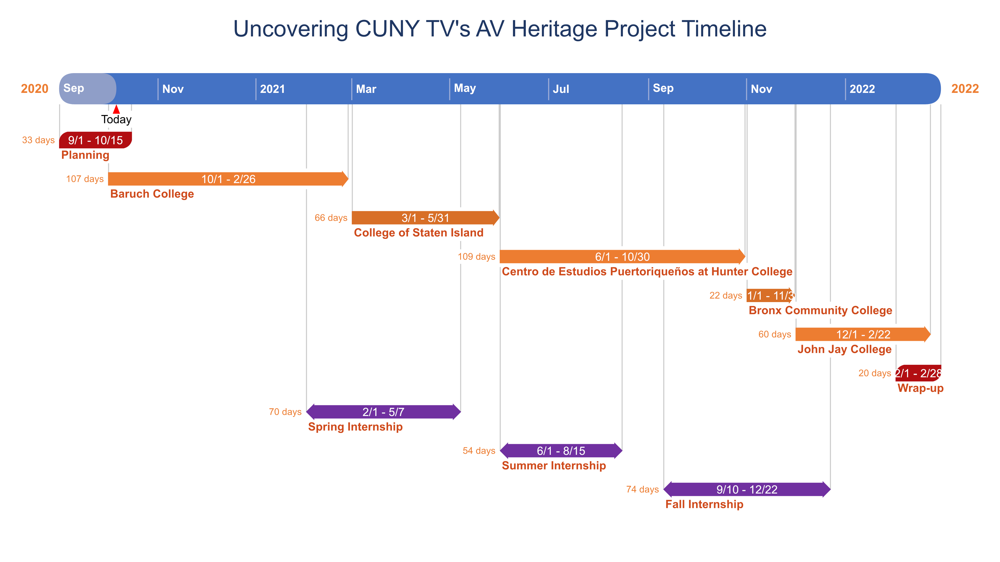

<h1>Uncovering CUNY's Audiovisual Heritage</h1>

| [Project Overview](#about)| [Project Plan](#plan)| [Collections Uncovered](#coll) | [Monthly Reports](#month) | [Credits](#cred) | [Appendices](#app)   
| ----------- | ----------- | ----------- | ----------- | --------------------- | ---------------------| 

:zap: :zap: :zap: :zap: :zap: :zap: :zap: :zap: :zap: :zap: :zap: :zap: :zap: :zap: :zap: :zap: :zap: :zap: :zap: :zap: :zap: :zap: :zap: :zap: :zap: :zap: :zap: :zap: 

 
As of 10/14/2022: 891 tapes digitized; 646 assets captioned and uploaded 

## <a name="about"> Project Overview </a>

"Uncovering CUNY's Audiovisual Heritage" aims to digitize, preserve, caption, and make accessible over 1,000 unique assets found in archival collections across the CUNY network. Roughly three quarters of the assets are from cable access programs that aired in New York City between 1985 and 2009. The project began in September of 2020 and finished in November of 2022. 

Funding for project was awarded by the _Digitizing Hidden Special Collections and Archives: Enabling New Scholarship through Increasing Access to Unique Materials_, a national grant competition administered by the Council on Library and Information Resources (CLIR). The initial proposal can be accessed as an [appendix](#app). 

The project can also be followed on [Twitter](https://twitter.com/hashtag/uncoveringcuny) and [Instagram](https://www.instagram.com/explore/tags/uncoveringcuny/) via the [#UncoveringCUNY](https://twitter.com/hashtag/uncoveringcuny) hashtag. 

## <a name="coll">Collections Uncovered</a>

The City University of New York (CUNY) is the largest university network in the country with over two dozen schools in every one of New York City's five boroughs. The chart below lists the five the schools partnering with this project, and public television collections they manage. Each collection is comprised of a series that aired between the 1980s and early 2000s, but only available on an obsolete videotape(or audiotape) format. Collectively, the content tells the story of New York City as it grapples with public policy and social justice in a delicate era just before, and just after, 9/11. Clicking through each institution will reveal a one-page description of the collections in their care. 

| Institution | Collection | Formats | # of Tapes Digitized| Streaming 
| ----------- | ----------- | ------- | ----------- | ----- 
| [Baruch College](2-Collections/BaruchCollegeSpecials/baruch.pdf) | Baruch College Special | U-matic, Betacam SP, DVCam | 175 | <a href="https://www.youtube.com/playlist?list=PLRqOW3sjwjhO296DyaxZlyIFSTSMh-w_g">Youtube.Com</a>
| [Baruch College](2-Collections/BronxCommunityCollege/baruchcc.pdf) | City Club | U-matic, Betacam SP, DVCam | 171 | <a href="https://www.youtube.com/playlist?list=PLRqOW3sjwjhO2HE03E3YRU3BPPdNXjbCN">Youtube.Com</a> <a href="https://archive.org/search.php?query=subject%3A%22City+Club+of+New+York+Friday+Forum%22&sort=titleSorter">Archive.Org</a>
| [Centro de Estudios Puertoriqueños at Hunter College](2-Collections/CentroHunter/hunter.pdf)| HoMoVisiones | VHS | 168 | <a href="https://archive.org/details/homovisiones">Archive.Org</a>
| [Centro de Estudios Puertoriqueños at Hunter College](2-Collections/CentroHunter/hunter.pdf) | Politics con Sabor | MiniDV | 108 | <a href="https://centropr-archive.hunter.cuny.edu/collections/collection-descriptions-O-P">Request from Centro</a>  
| [Centro de Estudios Puertoriqueños at Hunter College](2-Collections/CentroHunter/hunter.pdf)| Centro Records | VHS | 65 | <a href ="https://centropr-archive.hunter.cuny.edu/collections/collection-descriptions-C">Request from Centro</a>
| [College of Staten Island](2-Collections/CinemaThenCinemaNow/staten.pdf) | Cinema Then, Cinema Now | U-matic, Betacam SP | 166 | <a href="https://www.youtube.com/playlist?list=PLRqOW3sjwjhPFrX88ARrTYd7axdxPdipJ">Youtube.Com</a> <a href="https://archive.org/details/@cuny_tv?and%5B%5D=subject%3A%22Cinema+Then+Cinema+Now%22&sort=titleSorter">Archive.Org</a>
| [Bronx Community College](2-Collections/BronxCommunityCollege/bronx.pdf) | Hall of Fame for Great Americans | VHS, 1/4" audio magnetic tape | 25 | <a href="https://www.dropbox.com/s/rxwduf2bveghczh/Hall%20of%20Fame%20for%20Great%20Americans%20collection%201894-2008.pdf">Request from Bronx Community College</a>
| [Medgar Evers College](2-Collections/MedgarEversCollege/mec.pdf) | Medgar Evers College Archives | U-Matic | 13 | <a href="https://archive.org/details/@mec_archives">Archive.Org</a>
| | | Total | 891

## <a name="plan">Project Plan</a>  

### Timeline

The Gantt chart below visualizes the 18 month timeline (9/1/2020 - 2/28/2022). Collections will be completed self-contained cycles comprised of such tasks as cataloging, digitization, ingest, captioning, and public access. The length of time estimated is informed by the number of tapes in the collection. Outreach efforts will officially begin February 2021 after the first cycle is complete and will be engaged on a weekly basis via social media, press releases, newsletters, listervs, blog posts, and person-to-person contact. The timeline also indicates semesters where a student intern will assist the efforts. 

## <a name="month">Year 1 Monthly Reports</a>

<a href="/MonthlyReports/2020Sept.pdf">September 2020</a> | <a href="/MonthlyReports/2020Oct.pdf">October 2020</a> | <a href="/MonthlyReports/2020Nov.pdf">November 2020</a> | <a href="/MonthlyReports/2020Dec.pdf">Decemeber 2020, January 2021</a> | <a href="/MonthlyReports/2021Feb.pdf">February 2021</a> | <a href="/MonthlyReports/2021March.pdf">March 2021</a> | <a href="/MonthlyReports/2021Apr.pdf">April 2021</a> | <a href="/MonthlyReports/2021May.pdf">May 2021</a> | <a href="/MonthlyReports/2021June.pdf">June 2021</a> | <a href="/MonthlyReports/2021July.pdf">July 2021</a> | <a href="/MonthlyReports/2021Aug.pdf">August 2021</a> | <a href="/MonthlyReports/2021Sept.pdf">September 2021</a> | <a href="/MonthlyReports/2021Oct.pdf">October 2021</a> | <a href="/MonthlyReports/2021Nov.pdf">November 2021 | <a href="/MonthlyReports/2021Dec.pdf">December 2021

## <a name="cred">Credits </a>

_CUNY TV_ 

Kelly Haydon, Project Manager 
David Rice, Director of Archives 
Catriona Schlosser, Archivist 
Michael "Flip" DiFillipio, Engineer   
Eric Silberberg, Graduate Intern (Spring 2021) 
Aida Garrido, Graduate Intern (Summer 2021) 
Liza Kastrilevich, Graduate Intern (Spring 2022) 
Brian Dunbar, Graduate Intern (Fall 2022)

_Collection Managers_  

Arthur Downing, Vice President for Information Services and Dean of the Library at Baruch College 
Cynthia Tobar, Assistant Professor/Head of Archives, Bronx Community College 
Lindsay Wittwer, Digital Archivist, Centro de Estudios Puertoriqueños at Hunter College 
Jerry Carlson, Host of _Cinema Then, Cinema Now_ and  
Tom Gubernat, Media Archive Technician, Charles Evans Inniss Memorial Library, Medgar Evers College

 
## <a name="app">Appendices</a>

<a href="1-Project/Grants/2019_CLIR_CUNY_2ndRound.pdf">CLIR 2019 Proposal</a> 
<a href="1-Project/Grants/2019_CLIR_CUNY_2ndRoundBudget.xlsx"> CLIR 2019 Budget</a> 
<a href="1-Project/Grants/2019_CLIR_CityClubInventory.pdf"> City Club Inventory </a> 
<a href="1-Project/Grants/2019_CLIR_CUNY_RightsResuse.pdf">Rights, Ethics, and Reuse Statement</a> 
<a href="1-Project/Grants/2020_CUNYTV_ERF_Narrative.pdf">2020 Emergency Relief Fund Narrative</a> 
<a href="1-Project/Grants/2020_CUNYTV_ERF_Budget.xlsx">2020 Emergency Relief Fund Budget</a> 

 
 

*When a cassette tapes turns into a lightning bolt, 32 tapes have been digitized. "Captioned" can mean either auto-captioned or manual review by a human. Stats are pulled from the CLIR TRANSFER LOG in Airtable: https://airtable.com/appx1LX5xKBtLqJk9/tblKFLZDSaayGTzuB/viwbgcK68SbHSqnAw?blocks=hide
